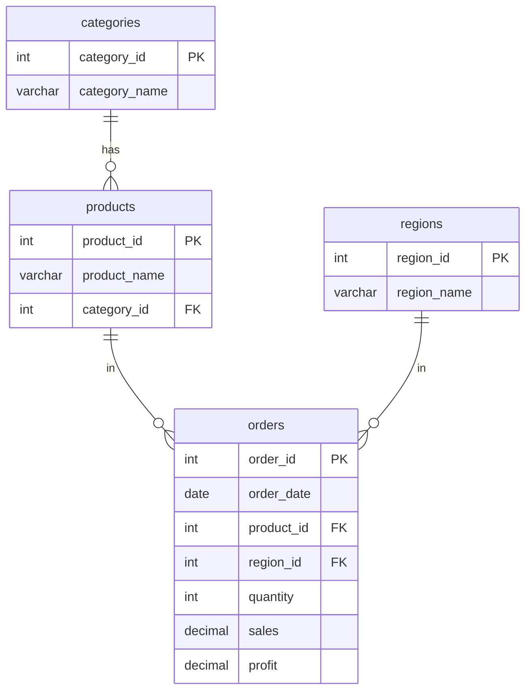

# Entity Relationship Diagram - Ecommerce Sales Database

## Mermaid ERD

## Table Descriptions

| Table       | Role        | Description                                              |
| ----------- | ----------- | -------------------------------------------------------- |
| categories  | Dimension   | Product categories (Office, Accessories, Electronics)    |
| products    | Dimension   | Products with category reference                         |
| regions     | Dimension   | Sales regions (North, East, South, West)                 |
| orders      | Fact        | Time-series order records (date, product, region, metrics)|

## Relationships

- **categories → products**: One-to-many. Each category has many products.
- **products → orders**: One-to-many. Each product appears in many orders.
- **regions → orders**: One-to-many. Each region has many orders.
